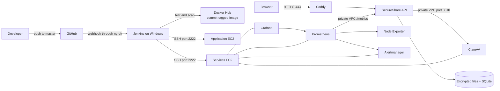

# SecureShare

SecureShare is a .NET 10 file-sharing application with authenticated encryption, expiring links, password protection, and a private owner dashboard. SQL Server Express stores metadata in the full local stack, while the current production profile uses SQLite; encrypted files and key material use persistent Docker volumes.

The supplied project synopsis and its implementation mapping are available under [Project synopsis implementation](docs/synopsis-implementation.md).

This repository is also a complete DevSecOps course project: a push to GitHub triggers Jenkins through a webhook, the pipeline tests and scans the revision, publishes an immutable commit-tagged image, and deploys it to Terraform-managed AWS infrastructure. Prometheus, Grafana, Node Exporter, and Alertmanager provide operational visibility, while verified encrypted backups and an audited Terraform destroy workflow cover recovery and cost control.

> **Verified implementation:** Jenkins build **#107** successfully deployed commit `282333bf1f6bc46a92d31e2e0bd1959c7eb5babd`. The run passed 24 tests, Entity Framework migration validation, Trivy source and image gates, Terraform validation, Docker Hub publication, encrypted backup creation, production migration, container health checks, and the public readiness check.

## Architecture



Terraform creates a dedicated VPC, public and private subnets, routing, security groups, two Ubuntu EC2 instances, encrypted gp3 root disks, and an IAM instance profile for Systems Manager. The application node runs the API and Caddy. The services node runs malware scanning and monitoring so those workloads do not compete with the API. The current design intentionally uses one writable API instance because encrypted uploads and the production SQLite database are stored in local Docker volumes.

## Features

- Upload files up to 100 MB with a 1–168 hour expiry and 1–100 allowed downloads.
- Optional passwords, hashed with PBKDF2 through ASP.NET Core Identity.
- AES-256-GCM in bounded 64 KiB frames authenticates ciphertext, frame order, and the end of the file.
- File keys are protected with ASP.NET Core Data Protection. Production requires a separate wrapping certificate.
- Owner-only listing, download history, revocation, deletion, and recovery on another device.
- Atomic download claims with transactional audit logging and retry idempotency.
- ClamAV scanning in Docker; scanner outages reject uploads.
- Server-side input validation, CSRF protection, IP rate limiting, and storage quotas.
- Cleanup removes unavailable file data and keys every 60 seconds; orphan reconciliation runs after 24 hours.
- Health endpoints, Prometheus application metrics, Node Exporter host metrics, Grafana, and Alertmanager.
- Verified, encrypted backups and a CI pipeline with tests, security scans, readiness verification, and application-image rollback.

A recovery code is a private management credential. Anyone with the code can manage that owner's files. Anyone with a share link can inspect its file metadata and download it unless a file password is required. There is no email account system or recipient identity verification.

## Local Docker setup

Requirements: Docker Desktop with Linux containers, Docker Compose 2.24.4 or newer, and PowerShell 7 for the Windows initialization script. Allow sufficient Docker memory for SQL Server and ClamAV; the full stack is intended for a host with at least 8 GB RAM and spare disk capacity for working files and backups.

Windows:

```powershell
./scripts/Initialize.ps1
docker compose up -d --build --wait --wait-timeout 600
```

Linux, on a fresh checkout:

```bash
sudo bash scripts/initialize.sh localhost
sudo docker compose up -d --build --wait --wait-timeout 600
```

Initialization generates fresh passwords and a wrapping certificate in ignored local files. It refuses to overwrite an existing `.env`. Preserve those secrets when updating an installation; changing the SQL password in Compose does not change an existing SQL Server login.

Services:

| Service | Local address |
| --- | --- |
| Upload portal and private dashboard | http://localhost:8080 |
| Swagger, development only | http://localhost:8080/swagger |
| Grafana | http://localhost:3000 |
| Prometheus | http://localhost:9090 |
| Alertmanager | http://localhost:9093 |
| API liveness | http://localhost:8080/health/live |
| API readiness | http://localhost:8080/health/ready |

Grafana's password is generated in `.env`; its username is `admin`. SQL Server and ClamAV have no published host ports. All published development services bind to localhost.

ClamAV may need several minutes to download signatures on first startup. Uploads remain unavailable if scanning is not ready.

## Development and testing

Requirements: .NET 10 SDK. The project uses SQL Server; local `dotnet run` defaults to Windows SQL Express in `appsettings.json`. Supply `ConnectionStrings__DefaultConnection` for a different SQL Server.

```powershell
dotnet restore SecureShare.slnx --locked-mode
dotnet test SecureShare.slnx -c Release --no-restore
dotnet run --project SecureShare.API
```

Tests use an isolated SQLite database, temporary file storage, and ASP.NET Core's test server. They verify frame boundaries and tampering, concurrent download claims, passwords, owner isolation, CSRF, recovery, quotas, scanner failures, cleanup, missing files, and legacy upgrades. SQL Server and ClamAV require a separate Docker integration check.

Direct `dotnet run` in Development does not enable scanning by default. Docker enables it explicitly. Production enables scanning by default and requires certificate-protected Data Protection keys. Never expose Development to the internet.

## Configuration

Environment variables use ASP.NET Core's `__` separator.

| Setting | Default |
| --- | --- |
| Storage__MaxFileBytes | 104857600 |
| Storage__OwnerQuotaBytes | 524288000 |
| Storage__TotalQuotaBytes | 5368709120 |
| Storage__MaxFilesPerOwner | 100 |
| Storage__MaxTotalFiles | 10000 |
| Storage__MaxExpiryHours | 168 |
| Storage__MaxDownloads | 100 |
| Storage__CleanupSeconds | 60 |
| Storage__AuditRetentionDays | 30 |
| Storage__Path | SecureUploads |
| DataProtection__KeyPath | DataProtectionKeys |
| Scanner__Enabled | true in Production, false for direct Development |
| Scanner__Host / Scanner__Port | clamav / 3310 |
| Database__MigrateOnStartup | true in Development, false in Production |

ClamAV's `StreamMaxLength` and `MaxFileSize` must be adjusted in `deploy/clamd.conf` if the application upload limit is increased. Server processing uses temporary disk files; reserve headroom beyond the retained-file quota.

Requests are limited to 120 per minute per IP, with additional limits of 10 uploads and 10 download attempts per minute. At most eight application requests run concurrently; health and metrics requests are excluded from that concurrency cap. These limiters are local to one application process. This deployment supports one API instance with local persistent storage.

## API flow

1. GET `/api/session` establishes an HttpOnly owner cookie and returns a CSRF token, recovery code, and limits.
2. Send the CSRF token in `X-CSRF-TOKEN` for every POST or DELETE.
3. POST multipart data to `/api/files/upload` with `file`, `expiryHours`, `maxDownloads`, and optional `password`.
4. Share the returned relative URL, resolved against the public site origin.
5. GET `/api/files/{id}/info` checks availability without consuming a download.
6. POST JSON `{"password": null}` or a password to `/api/files/{id}/download` to receive the file.

Owner endpoints: GET `/api/files`, GET `/api/files/{id}/logs`, POST `/api/files/{id}/revoke`, and DELETE `/api/files/{id}`. POST `/api/session/restore` accepts a recovery code; fetch a new session token after changing identities.

The original GET `/api/files/{id}` links redirect to the download page. A GET, link preview, or password failure never consumes an allowance. Missing or corrupt stored files are rejected before claiming an allowance.

A count records an authorized transfer, not confirmation that the recipient saved the complete file. A disconnect after authorization still consumes the allowance. Range requests are disabled to preserve predictable count semantics.

## Expiry and deletion

Unavailable links are blocked immediately. The cleanup worker deletes encrypted file data, protected encryption keys, IVs, and password hashes during its next cycle. Explicit deletion removes the owner's metadata and logs as well.

Access logs are retained for 30 days. Inactive metadata is removed 30 days after its expiry, or upload time for legacy records without expiry. Backups retain previous snapshots for their configured retention period; deletion from active storage does not erase existing backup archives.

Startup migration upgrades active legacy AES-CBC files to authenticated GCM without changing their IDs. Unreadable legacy files are retired. Old uploads have no owner identity because the original schema did not record one; they cannot be assigned to a browser safely. Back up the database and file storage before upgrading.

## Production deployment

To replace an unavailable AWS account, follow [Switch AWS accounts](docs/aws-account-switch.md). Terraform requires the intended 12-digit `expected_account_id`; use `scripts/Use-AwsAccount.ps1` to verify and save a named profile for this project.

The configured deployment uses AWS account `593602867169`, region `eu-north-1`, and local AWS CLI profile `hariharan`. Verify the identity without placing access keys in this repository:

```powershell
./scripts/Use-AwsAccount.ps1 -ProfileName hariharan -ExpectedAccountId 593602867169
```

Review the infrastructure before creation:

```powershell
terraform -chdir=teraform init
terraform -chdir=teraform fmt -check
terraform -chdir=teraform validate
terraform -chdir=teraform plan
terraform -chdir=teraform apply
terraform -chdir=teraform output
```

For a temporary course demonstration, prefer the lifecycle wrapper:

```powershell
./scripts/Start-EphemeralAwsEnvironment.ps1 -MaxLifetime 04:00:00
```

It schedules cleanup before `terraform apply`, so a partial apply is still covered, and then saves the resulting addresses for Jenkins. `MaxLifetime` must be between 15 minutes and 5 hours. The default instance type is `t3.micro`; Free Tier eligibility depends on the account and current AWS offer, so this setting does not guarantee zero cost.

The production Compose override adds Caddy with automatic HTTPS, removes the API's host port, and trusts only the configured Caddy proxy address for forwarded headers. Monitoring stays on localhost; access it through SSH tunnels or AWS Session Manager.

1. Provision infrastructure using `teraform/main.tf`. Run `terraform plan` and review it before applying.
2. Clone the repository to `/opt/secureshare` on the server. Generate server secrets with `sudo bash scripts/initialize.sh your-domain.example`.
3. Point the domain's DNS to the provisioned public IP.
4. Build or pull the API image and run the explicit migration job before starting Production:

```bash
sudo docker compose -f docker-compose.yml -f docker-compose.production.yml build secureshare-api
sudo docker compose -f docker-compose.yml -f docker-compose.production.yml up -d db clamav
sudo docker compose -f docker-compose.yml -f docker-compose.production.yml run --rm secureshare-api --migrate-only
sudo docker compose -f docker-compose.yml -f docker-compose.production.yml up -d --no-build --wait --wait-timeout 600
```

Use a fresh server key volume for Production; development Data Protection keys are not encrypted at rest. Production secrets must be readable by container UID/GID 1654; the Linux initialization script sets that ownership. Keep the wrapping certificate and password for as long as files or backups protected by it are retained.

Terraform defaults to two Free Tier-sized `t3.micro` instances, encrypted gp3 root volumes, IMDSv2, a dedicated VPC, public and private subnets, and an SSM role. The application and services nodes use assigned public IPs in the public subnet so they can download packages and container images without a billable NAT gateway. Their security groups expose only the required ports; the private subnet has no internet route and is reserved for future data services. SSH is disabled unless trusted CIDRs and a key pair are configured. Monitoring, SQL, and port 8080 are not publicly opened by Terraform. Optional AWS Budget alerts are configured with `budget_notification_email` and `monthly_budget_usd`. Optional, Terraform-managed course extensions provide an encrypted S3 backup bucket and a scheduled Lambda/CloudWatch readiness check; both remain disabled until explicitly selected. Remote Terraform state storage is deployment-specific and must be configured before team use.

Terraform manages the VPC, internet gateway, subnets, route tables, security groups, two EC2 instances, encrypted root disks, IAM role and instance profile, project tags, and any enabled budget/S3/Lambda/CloudWatch/EventBridge extensions. Resources created manually or from the separate CloudFormation comparison template are outside this Terraform state.

Existing installations must back up their current database and upload directory before switching to named volumes. The old Compose configuration had no volumes; new empty volumes cannot automatically recover data from old containers. Restore the old database and files into the new persistent storage before running migrations.

## CI/CD

### Trigger and delivery flow

```text
Push to master
  -> GitHub sends the webhook payload
  -> ngrok forwards it to local Jenkins
  -> Generic Webhook Trigger accepts refs/heads/master
  -> Jenkins checks out the exact revision
  -> restore, test, scan, package, publish, back up, migrate, deploy, verify
```

The pipeline is automatic for pushes to `master`. Other branches are deliberately filtered by `^refs/heads/master$`. Jenkins disables concurrent runs and applies a 90-minute build timeout.

Start the configured Jenkins tunnel when webhook delivery is required:

```powershell
./scripts/Start-JenkinsNgrok.ps1
```

If ngrok assigns a new public URL, update the GitHub webhook payload URL. Stop ngrok after the demonstration when inbound webhook access is no longer needed.

### Jenkins requirements

The current Jenkins controller/agent runs on Windows. It requires Git, Docker Desktop, .NET 10, EF CLI 10, Terraform, OpenSSH, and the Generic Webhook Trigger, Credentials Binding, and SSH Credentials plugins. This local installation exposes Docker Engine to Jenkins at `tcp://127.0.0.1:2375`; Docker Desktop must be running before a build starts.

| Jenkins credential | Type | Purpose |
| --- | --- | --- |
| `docker-hub-id` | Username with password | Push the commit-tagged image to Docker Hub |
| `aws-ssh-key-id` | SSH username with private key | Deploy to both EC2 nodes as `ubuntu` |
| `secureshare-webhook-token` | Secret text | Authenticate the Generic Webhook Trigger endpoint |

For AWS account `593602867169`, Jenkins credential `aws-ssh-key-id` is an **SSH Username with private key** credential for user `ubuntu`. `DEPLOY_HOST` defaults to the Terraform-managed server, and `deploy/known_hosts` pins that server's SSH host key. The private key stays in Jenkins. This SSH credential cannot run AWS API or Terraform commands; local AWS profile `hariharan` is used for Terraform commands run on this computer. See [AWS account switch](docs/aws-account-switch.md).

The GitHub push webhook starts the pipeline automatically. Jenkins uses its tracked SCM checkout so each built revision becomes the baseline for the next webhook. `Start-EphemeralAwsEnvironment.ps1` saves the current Terraform public and private addresses in the local Jenkins home; webhook builds use those addresses when build parameters are blank. `Destroy-AwsEnvironment.ps1` removes that target file after a verified destroy, so later pushes run CI checks without trying to deploy to deleted hosts.

### Pipeline stages and quality gates

| Stage | Work performed | Gate |
| --- | --- | --- |
| Checkout | Delete the old workspace and check out the webhook revision | SCM failure stops the run |
| Resolve inputs | Read build parameters or Terraform-generated addresses and validate them | Partial or malformed deployment targets are rejected |
| Restore, build and test | Locked restore, Release tests, EF pending-model-change check | Dependency, test, build, or model drift stops the run |
| Security and infrastructure | Trivy filesystem vulnerability/secret/misconfiguration scan; Terraform format/init/validate | HIGH or CRITICAL findings and invalid IaC stop the run |
| Build and scan image | Build the Docker image and run the Trivy image scan | Unsafe images are not published |
| Push image | Authenticate to Docker Hub and push the full Git SHA tag | Only an immutable revision proceeds to deployment |
| Deploy and verify | Deploy services, back up the app, migrate, start containers, and verify readiness | SSH, backup, migration, health, or readiness failure stops the run |

Jenkins archives TRX test results and JSON Trivy reports as evaluation evidence. Deployment uses the pinned host key, a verified encrypted backup, explicit migrations, and container readiness checks. Supplying all four address parameters overrides the locally saved Terraform target.

The services node is deployed first so ClamAV is ready before the application is tested. The app deployment checks out the exact commit, pulls the exact image tag, creates a backup, runs the migration, starts Caddy and the API, and waits for the readiness endpoint.

### Dynamic AWS addresses and `nip.io`

Terraform-created public IP addresses can change after destroy/apply. `Start-EphemeralAwsEnvironment.ps1` writes the current public and private addresses to `C:\ProgramData\Jenkins\.jenkins\secureshare-deployment.env`; webhook builds read this file when build parameters are blank. No IP address needs to be committed to the `Jenkinsfile`.

The production URL uses `https://<application-public-ip>.nip.io/`. `nip.io` resolves the IP embedded in the hostname, which lets Caddy obtain a standard HTTPS certificate without purchasing a domain. The URL changes when Terraform creates an instance with a different public IP.

Verify the deployed service with:

```powershell
curl.exe -f https://<application-public-ip>.nip.io/health/ready
ssh -p 2222 -i <private-key> ubuntu@<application-public-ip> "cd /opt/secureshare && docker compose ps"
```

The expected result is HTTP 200 and healthy API and Caddy containers.

Updates use a brief maintenance window. On failure, a previous image advertising encryption format 2 can be restored. The original application cannot read protected keys or GCM files; rollback across the first upgrade requires restoring the pre-upgrade database and file archive together. Database migrations are not automatically reversed. The included schema migration is additive, while legacy encryption conversion changes stored data.

## Backups and recovery

Create a consistent, verified, encrypted backup:

```powershell
./scripts/Backup.ps1
# Add -Production for the production Compose override.
```

Linux:

```bash
sudo bash scripts/backup.sh --production
```

The API pauses during the snapshot. The archive includes a SQL backup, encrypted uploads, the Data Protection key ring, and the wrapping certificate/password. GPG encrypts it using `secrets/backup-password`, which is excluded from the archive. Save that password separately in a secure password manager. Losing the password makes the archive unrecoverable.

For daily production backups, install the provided service and timer:

```bash
sudo cp deploy/secureshare-backup.service deploy/secureshare-backup.timer /etc/systemd/system/
sudo systemctl daemon-reload
sudo systemctl enable --now secureshare-backup.timer
```

Local Linux archives expire after 30 days. Configure `BACKUP_S3_URI` in the backup service environment and install/configure AWS CLI to copy encrypted archives off the server. The copy does not delete remote archives; configure remote retention separately.

Recovery should first be rehearsed on an isolated deployment:

1. Decrypt the selected `.tar.gz.gpg` archive with GPG using your separately saved backup password.
2. Stop the target API. Restore `uploads/` and `keys/` into their matching Docker volumes, and the wrapping certificate/password into the target `secrets/`.
3. Copy `database/secureshare.bak` into SQL Server's backup volume. Run `RESTORE VERIFYONLY`, then `RESTORE DATABASE [SecureShareDb]` with SQL Server in single-user mode.
4. Apply any required forward migrations, start the API, and verify a known file download and owner recovery code.
5. Remove temporary decrypted archives after verification.

Do not remove persistent volumes during updates. Keep secrets and off-server backups separate from the public repository.

## Monitoring

Prometheus scrapes `/metrics` and Node Exporter; Caddy blocks application metrics publicly. Grafana provisions the included runtime, SecureShare and host-infrastructure dashboards. Alert rules cover API availability, HTTP server errors, storage usage, stalled cleanup, host CPU, memory, disk and Node Exporter availability.

Alerts are visible in the local Alertmanager UI. Configure an external receiver in `deploy/alertmanager.yml` for email or webhook delivery; no messages are sent by the default configuration.

The monitoring ports remain private. While the services instance is running, create an SSH tunnel:

```powershell
ssh -p 2222 -i <private-key> `
  -L 3000:127.0.0.1:3000 `
  -L 9090:127.0.0.1:9090 `
  -L 9093:127.0.0.1:9093 `
  ubuntu@<services-public-ip>
```

Then use `http://localhost:3000` for Grafana, `http://localhost:9090` for Prometheus, and `http://localhost:9093` for Alertmanager.

## Destroying the AWS environment

Use the repository script after each temporary demonstration:

```powershell
./scripts/Destroy-AwsEnvironment.ps1
terraform -chdir=teraform state list
```

The script runs `terraform destroy`, verifies that no tracked resource remains, removes the obsolete Jenkins address file, and writes `logs/terraform-destroy.log`. An empty state proves only that the selected Terraform state is empty. It does not remove manually created AWS resources or a separate CloudFormation stack. Confirm the result in AWS Resource Explorer and Cost Explorer. Jenkins, Docker Desktop, ngrok, Prometheus, Grafana, and Alertmanager run locally and are outside `terraform destroy`.

## Troubleshooting

### A push does not trigger Jenkins

1. Confirm the commit is visible on GitHub and belongs to `master`.
2. Confirm Jenkins is running at `http://localhost:8081`.
3. Start or inspect the ngrok tunnel.
4. Confirm the GitHub webhook contains the current ngrok hostname and correct trigger endpoint.
5. Inspect **Recent Deliveries** in GitHub; a successful delivery must receive a successful HTTP response.
6. Confirm the payload reference is `refs/heads/master`.

### Jenkins runs CI but skips deployment

Deployment is skipped when all target values are blank. Start the environment with `Start-EphemeralAwsEnvironment.ps1`, check that the Jenkins deployment address file exists, or supply all four build parameters: `DEPLOY_HOST`, `APP_PRIVATE_IP`, `SERVICES_HOST`, and `SCANNER_PRIVATE_IP`. A partial set is rejected.

### Jenkins cannot use Docker

Start Docker Desktop, select Linux containers, and verify `docker version` from the Windows account running the Jenkins service. The pipeline expects the Docker Engine at `tcp://127.0.0.1:2375` in this local setup.

### HTTPS is unavailable

Confirm AWS allows ports 80 and 443, the `nip.io` hostname contains the current app IP, and Caddy can reach the internet to obtain its certificate. Inspect `docker compose logs caddy` on the application node.

### Uploads fail after deployment

ClamAV may still be loading signatures. Check its health on the services node and verify private VPC connectivity from the app node to scanner port 3310.

### Backup or deployment reports permission denied

Runtime secrets and volumes deliberately have restrictive ownership. Use the supplied deployment and backup scripts with their documented `sudo` behavior; do not make secrets world-readable.

## Evaluation evidence checklist

Capture the following while the temporary environment is available:

1. The GitHub commit and successful webhook delivery.
2. Jenkins stage view showing checkout, testing, scans, image push, deployment, and verification.
3. The 24-test result and archived TRX test artifact.
4. Archived Trivy JSON reports and the HIGH/CRITICAL gate result.
5. Terraform plan/output and AWS resources carrying the `Project=SecureShare` tag.
6. The Docker Hub image tagged with the full deployed Git commit.
7. The public HTTPS application and `/health/ready` returning HTTP 200.
8. Healthy containers on both EC2 nodes.
9. Grafana dashboards, Prometheus targets, and Alertmanager status.
10. An encrypted `.tar.gz.gpg` backup with restrictive permissions.
11. `terraform destroy` followed by an empty `terraform state list`.

Never include `.env`, AWS credentials, SSH private keys, certificate or backup passwords, Terraform state, session cookies, CSRF tokens, recovery codes, or unredacted Jenkins credentials in submitted screenshots.

## Known limitations and future work

- Only one API instance can write to the current local encrypted-file volume and SQLite database.
- Rate limiting is local to the application process.
- Horizontal scaling requires shared object storage, a shared database, distributed rate-limit coordination, and a load balancer.
- The private subnet is reserved for a future private data tier and currently contains no instance.
- Terraform state is local; team use requires a private encrypted remote backend with locking.
- Alertmanager has no external notification receiver by default.
- Software bill of materials generation and image signing remain future supply-chain controls.
- Free Tier eligibility and credits depend on the AWS account and current AWS terms.

These limits are recorded so evaluation can distinguish implemented controls from proposed extensions.

## Project layout

```text
SecureShare.API/        API, infrastructure services, migrations, and browser portal
SecureShare.Core/       Domain entities and service contracts
SecureShare.Tests/      Security and file-flow regression tests
deploy/                HTTPS, scanning, alerts, backup image, and timer configuration
scripts/               Initialization, backup, and deployment scripts
grafana/               Provisioned dashboards and data source
teraform/              AWS infrastructure (original directory name retained)
infrastructure.yaml    Equivalent AWS CloudFormation template
docs/                  Project synopsis, implementation notes, and AWS account guidance
```

The course mapping and destruction boundary are documented in [INT378 course outcomes](docs/course-outcomes-mapping.md) and [AWS resource lifecycle](docs/aws-resource-lifecycle.md).
